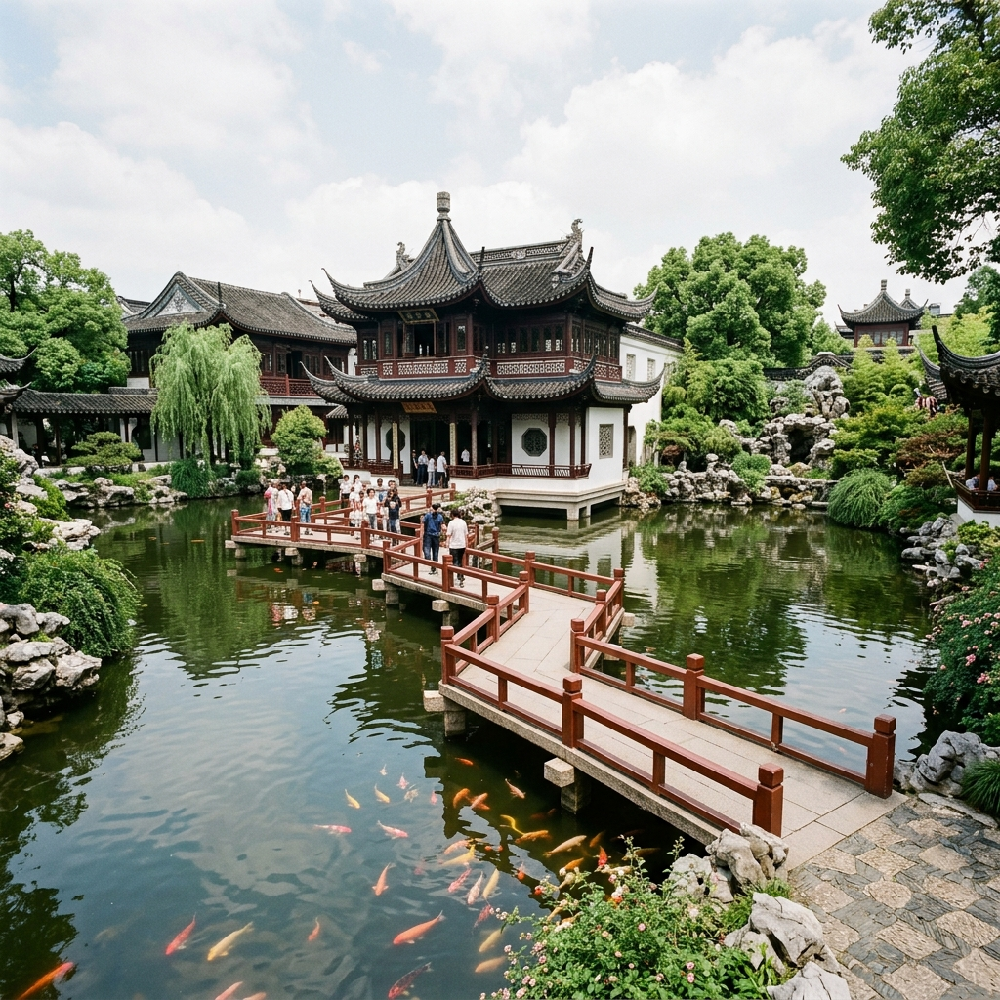
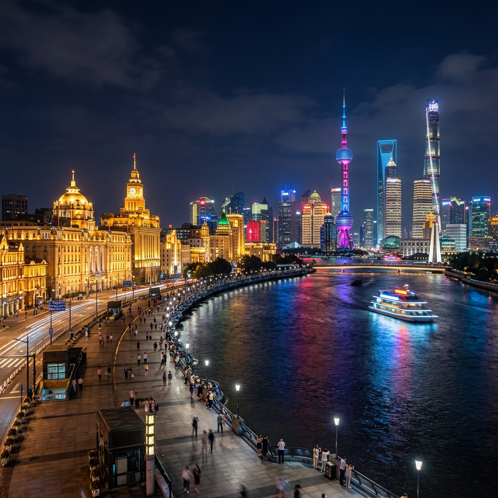
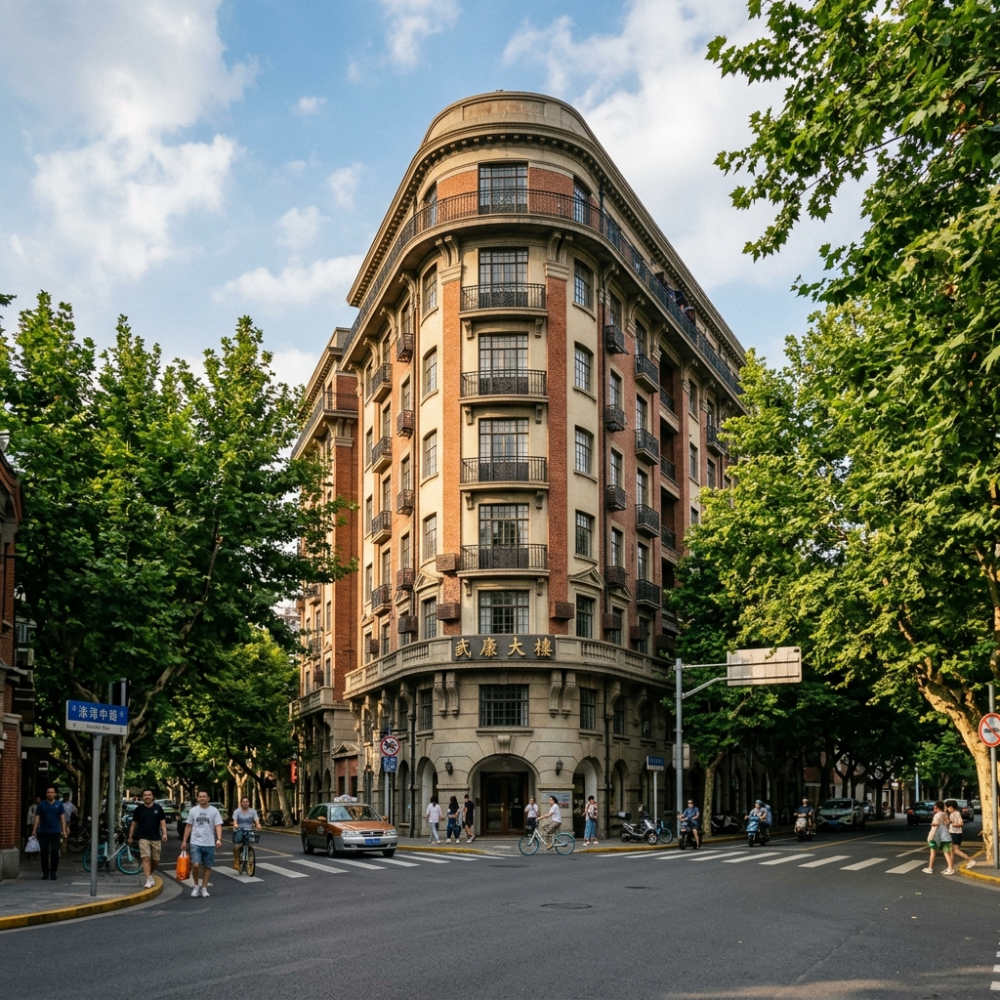
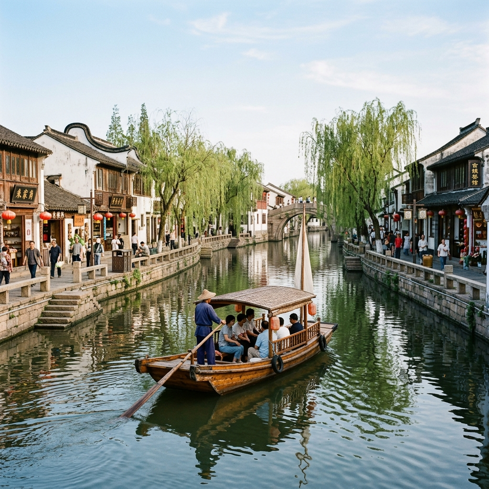
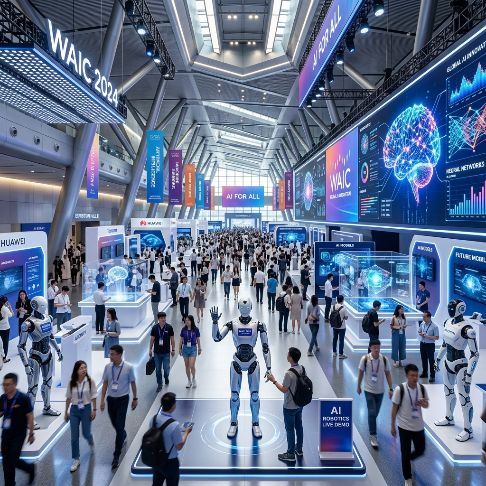
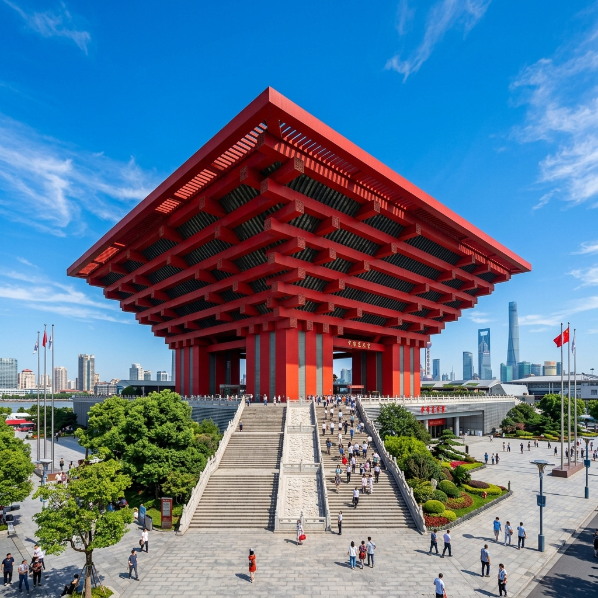
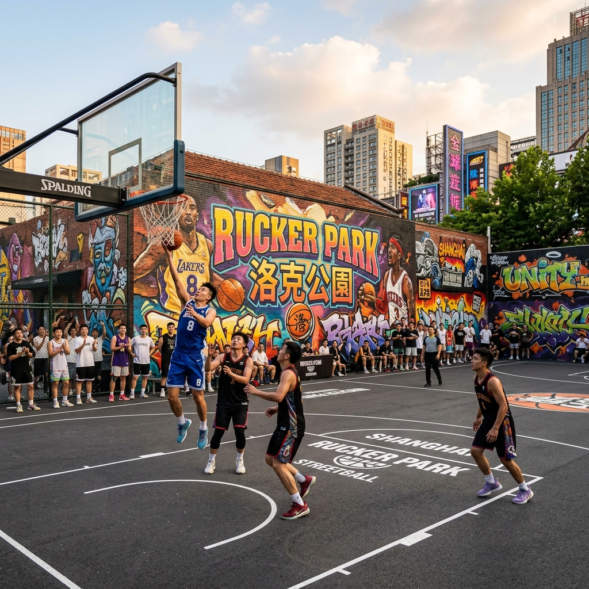
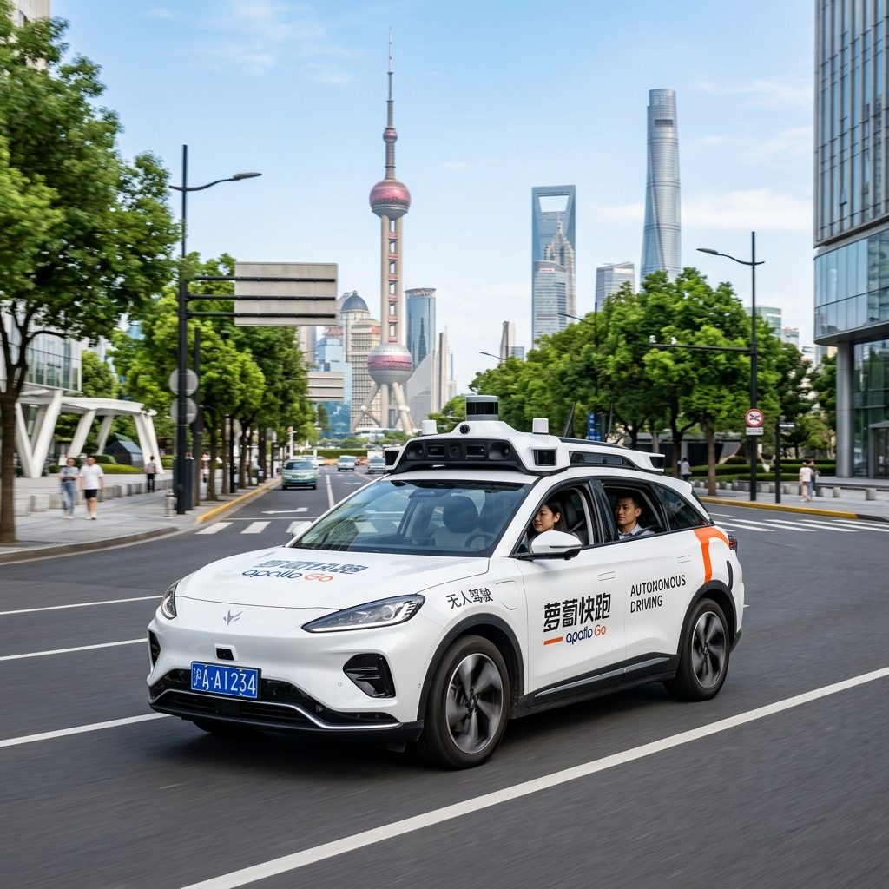
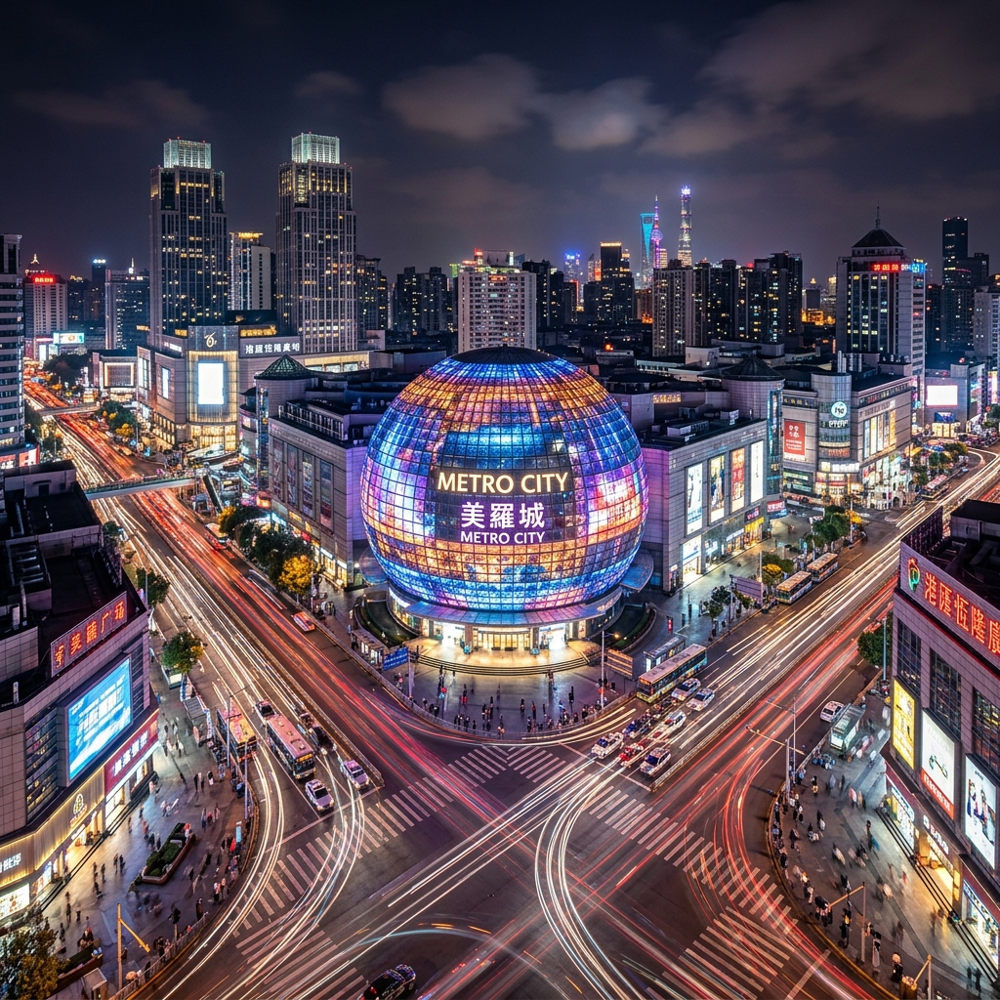
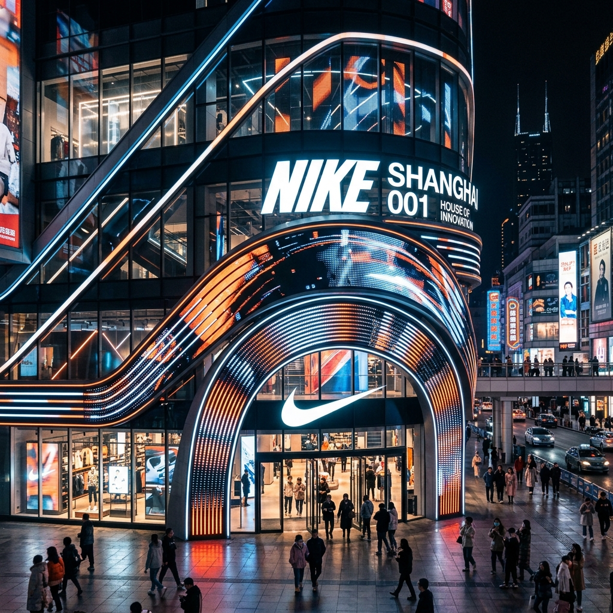

# 上海熱門景點深度導覽與低步行逛法

本指南為全家人設計了適度步行、動線流暢的景點導覽方案，並融入了 **2026 年世界人工智慧大會 (WAIC 2026)** 的參展指引，讓旅程舒適又充實。

---

## 1. 經典人文與江景：豫園 ＋ 外灘

本區帶您感受上海的歷史底蘊與現代繁華。

### 導覽與逛法
*   **第一站：豫園（古典園林）**
    *   **如何逛**：建議下午 15:30 抵達。避開外圍擁擠且步行距離長的豫園老街小商品市場，直接購買門票（門票約 30 - 40 元人民幣，可在大眾點評 APP 預購）進入豫園核心園區。園內為江南林園精華，亭台樓閣緊湊，步行距離僅約 800 公尺。重點參觀「九曲橋」、「玉玲瓏」（江南三大名石之一）與「三穗堂」。
    *   **適度步行秘訣**：園內多設有連廊與靠椅，可隨時歇息欣賞錦鯉，觀賞石雕與古建築。
    
    

*   **第二站：外灘（萬國建築群與黃浦江景）**
    *   **如何逛**：從豫園直接搭乘網約車（車程約 10 分鐘，費用約 15 元），定位在「**外灘金融牛**」或「**中山東一路福州路口**」下車。下車後直接上外灘觀景平台。
    *   **適度步行秘訣**：此處是觀賞黃浦江對岸陸家嘴「三件套」（東方明珠、上海中心大廈、環球金融中心）與外灘百年歷史建築群的最佳交界點。沿著江邊平台向北步行約 500 公尺即可拍出經典大片，不需走完整條外灘。
    *   **交通回程**：拍照結束後，向西步行約 500 公尺至「南京東路站」搭乘地鐵 2 號線（搭乘 1 站即可回到南京西路飯店），或直接在中山東一路叫車回飯店。
    
    

---

## 2. 法租界落葉梧桐散策：武康路 ＋ 安福路

本區極富老上海文藝氣息，街區氛圍悠閒，綠蔭避暑。

### 導覽與逛法
*   **如何逛**：
    1.  搭乘地鐵 10 號線至「交通大學站」，或直接搭乘網約車定位在「**武康大樓**」（淮海中路 1850 號）下車。這棟熨斗狀的百年歷史公寓是上海最經典的人文地標，可在此合影留念。
    2.  沿著**武康路**向北步行。這段路兩旁種滿了法國梧桐樹，遮蔭效果極佳，有許多西班牙式與法式老洋房（如巴金故居）。
    3.  沿武康路步行約 800 公尺至**安福路**口左轉。安福路是文青買手店、特色咖啡店的聚集地。
*   **適度步行與休息策略**：
    *   整條路線步行距離約 1.2 公里，走走停停約需 1.5 小時。
    *   沿途有無數精緻的獨立咖啡館（如 RAC Coffee、Peet's Coffee），建議步行 20 分鐘即安排入座喝杯冷飲、吃個下午茶，悠閒享受街區的慢節奏。
    *   安福路上有許多特色文創小店與話劇中心，這段步行強度適中，落葉梧桐樹蔭很涼爽。
    
    

---

## 3. 江南水鄉以船代步：朱家角古鎮

體驗傳統水鄉景色，並透過遊船大幅降低步行的疲勞感。

### 導覽與逛法
*   **如何逛**：
    1.  **交通方式**：建議全家直接叫網約車前往（車程約 50 分鐘，費用約 150 - 180 元，免除地鐵多次站立轉乘之累）。
    2.  **以船代步低步行路線**：
        *   進入景區後，直接步行至最近的「課植園碼頭」或「古鎮入口碼頭」。
        *   購買「手搖船票」（可選擇遊覽單程或雙程，整船約 80 - 150 元人民幣，最多可坐 6 人）。
        *   乘船沿著狹窄水道穿梭，觀賞兩岸粉牆黛瓦的徽派民居，避開岸上擁擠的石板路與長途步行。
        *   於「放生橋碼頭」下船，放生橋是華東地區最大的一座五孔石拱橋。
    3.  **餐飲與歇息**：下船後在放生橋旁的臨水茶館（如喝杯江南阿婆茶）或特色餐館入座，一邊品嚐當地的「朱家角扎肉」與「糯米粽」，一邊欣賞水鄉夕陽，隨後搭車返回市區。
    
    

---

## 4. 科技與運動交匯：世博展覽館 ＋ 中華藝術宮 ＋ 洛克公園 ＋ 蘿蔔快跑

本區融合了最新 AI 科技展會（限時活動）、街頭籃球運動與人文藝術行程。

### 💡 避坑指引：博物館公休提示
*   **中華藝術宮**（原世博中國館）實行**「星期一公休」**政策。本指南已將其調整至 Day 4（星期三）參觀；而 Day 2（星期一）下午則專注於參觀限時舉辦的世界人工智慧大會與無人駕駛體驗。

### 導覽與逛法
*   **限時地標：2026 世界人工智慧大會 (WAIC 2026) 展覽**
    *   **活動展期**：2026 年 7 月 17 日 - 7 月 20 日（**7/20 星期一為最後一天**）。
    *   **展出地點**：上海世博展覽館（國展路 1099 號，鄰近世博源商場）。
    *   **如何逛**：需提前在大會官方網站或微信公眾號「世界人工智能大会」預約專業觀眾或公眾展區門票。大會將展出最新的人形機器人、生成式 AI 創新應用、自動駕駛與元宇宙互動設備，是極具前沿科技的盛宴。
    
    

*   **第一站：中華藝術宮（原世博中國館，安排於星期三）**
    *   **特色**：宏偉的紅色斗拱建築。館內珍藏有巨大的「**電子動態版清明上河圖**」（需於微信小程序提前預約免費門票，清明上河圖展廳現場加購 20 元門票）。
    *   **如何逛**：入館後直奔動態清明上河圖展廳，參觀時間約 1 小時，內部有空調且有無障礙電梯，步行強度低。
    
    

*   **第二站：洛克公園（世博源店，安排於星期三）**
    *   **特色**：世博源是一個超大型下沉式商場。這裡的洛克公園設有極具美式街頭塗鴉風格的室內外籃球場，是上海街頭籃球的標誌性場地。
    *   **如何逛**：從中華藝術宮步行約 5 分鐘即可進入世博源商場，可於現場觀賞當地的籃球愛好者鬥牛，或付費租用半場體驗投籃。
    
    

*   **第三站：蘿蔔快跑 (Robotaxi) 無人駕駛科技體驗**
    *   **特色**：百度研發的 L4 級自動駕駛出租車，世博片區為其營運示範區。後座有觸控螢幕顯示 AI 對周圍路況、車輛、行人的即時 3D 感知建模，充滿新鮮科技感。
    *   **如何體驗**：使用 APP 叫車，起點設為世博源或世博展覽館，終點設為「梅賽德斯-奔馳文化中心」，體驗無人駕駛。
    
    

---

## 5. 二次元與 3C 二重奏：徐家匯美羅城

本區是尋找手遊周邊、3C 數碼產品與電玩體驗的二次元地標。

### 導覽與逛法
*   **如何逛**：
    1.  搭乘地鐵 9 號線直達「徐家匯站」，出站直接連通「美羅城」百貨地下一樓。
    2.  **美羅城（二次元與潮流聖地）**：
        *   **B1 樓 ＆ 3 樓**：聚集了大量的動漫線下旗艦店。包括 animate、米哈遊（Mihoyo）周邊專賣店（原神、崩壞星穹鐵道）、騰訊手遊周邊店、任天堂授權店及 Sony 旗艦店。
    3.  **百腦匯 (BuyNow) 科技廣場**：
        *   位於美羅城對面。內有各種最新智慧型手機、VR 體驗館、遊戲外設配件以及電競組裝機展示，是上海最著名的 3C 商場。
*   **餐飲推薦**：美羅城內有多家高性價比（高 CP 值）的平民美食，如「小楊生煎」（招牌三拼生煎）與「佳家湯包」（現包蟹粉鮮肉小籠），人均約 30 - 50 元人民幣。
    
    

---

## 6. 運動潮流與科技地標：Nike 上海 001

全球首家 Nike House of Innovation 旗艦店，融合了運動裝備與互動科技體驗。

### 導覽與逛法
*   **特色**：位於南京東路步行街起點的世茂廣場，共有 4 層樓空間。店內設有「Nike By You」專屬定制區（可客製化球鞋與服飾），並在 1 樓設有數字化感應互動跑道，可進行運動感應挑戰，充滿科技感，非常適合年輕人與球鞋愛好者。
*   **如何逛**：建議搭乘地鐵 2 號線至「人民廣場站」由 19 號出口出站，直接進入世茂廣場。參觀與體驗時間約 1 - 1.5 小時。
    
    
